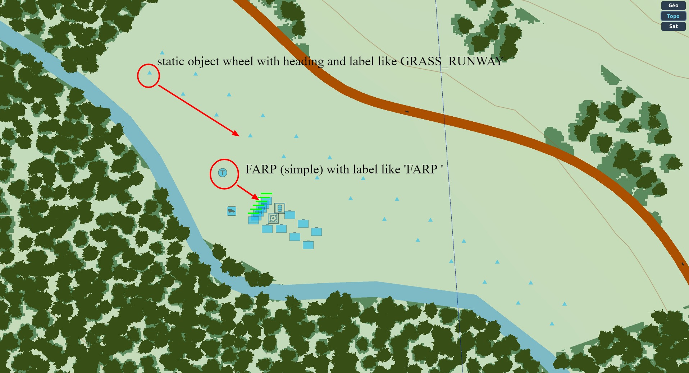
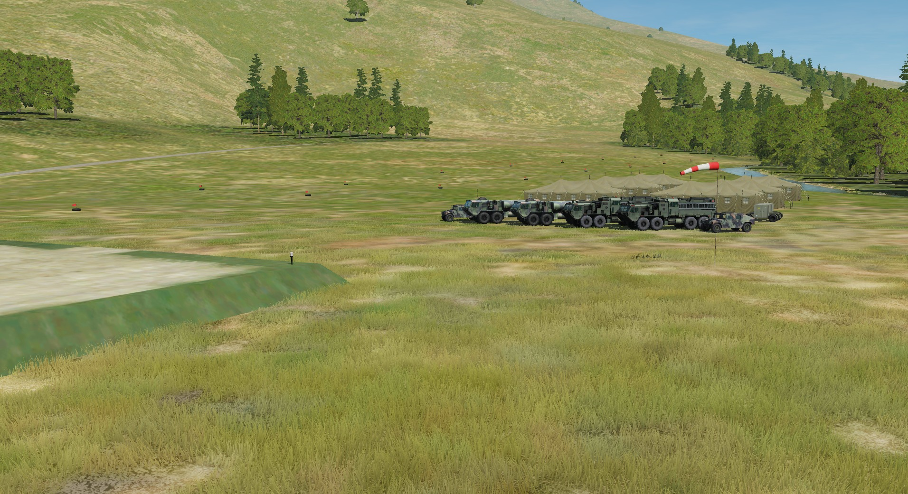
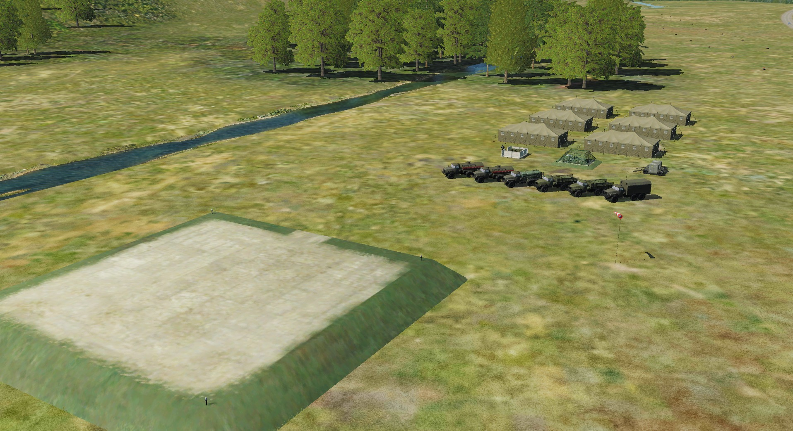
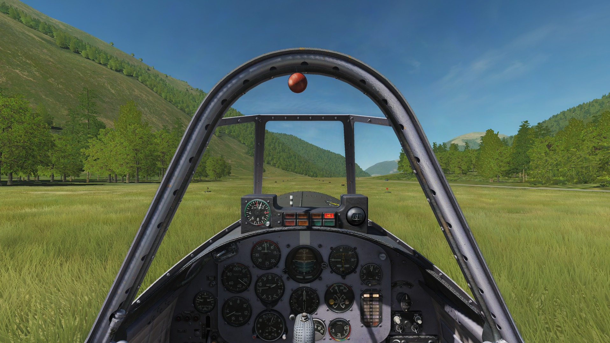

# Grass Runways (and FARPS units)

The script [grass.lua](../lib/grass.lua) help the mission maker to build:

* grass runways (from only one object)
* FARPS units (tents, trucks, windsock)

## Mission Maker

To use Grass Runways features, add grass.lua on mission start

## Auto build

## Auto build units on FARPS

* place a SINGLE_HELIPAD FARP 
* add in its group name "FARP " (note the blank space at the end of string)
* choose a heading (static units will be build "behind" the FARP)

Blue side:

Red side:

## Auto build GRASS RUNWAYS

* place a static object (Black_Tyre_RF / Black Tyre with Red Flag)
* add in its group name "GRASS_RUNWAY"
* choose a heading (this static object is the origin of the right side of the runway)

Result sample:

